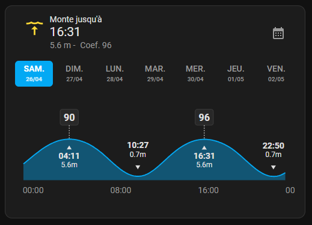
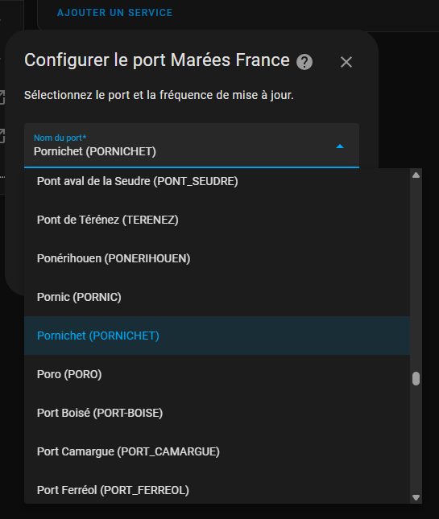
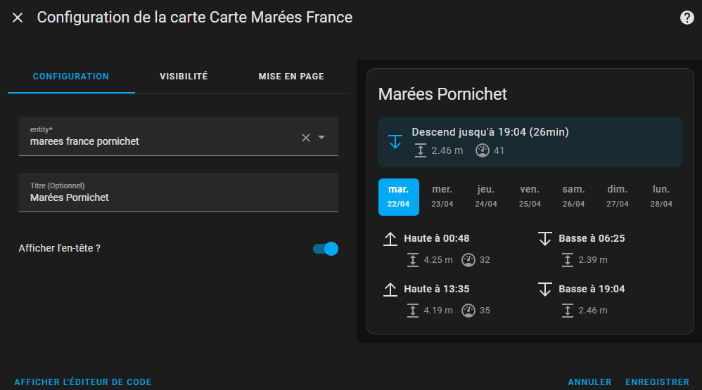

# 🌊 Intégration Home Assistant — Marées France

👉 [EN Read this documentation in English](./README.md)

**Affichez les marées françaises du SHOM directement dans Home Assistant, grâce à une intégration simple et une carte Lovelace personnalisée.**



**Auteur** : [@KipK](https://github.com/KipK)

---

## 🚀 Installation

Recherchez dans HACS et installez l'intégration "Marées france".

Une fois l'intégration installée et configurée, rafraichissez le navigateur pour que Home Assitant affiche la carte dans le sélecteur de carte.

---

## ⚙️ Configuration

1. Dans **Appareils et Services → Ajouter une intégration**, rechercher **Marées France**.
2. Sélectionner le **port le plus proche** dans la liste proposée.
3. *(Optionnel)* Définir la **profondeur minimale nécessaire pour naviguer** — cette valeur sera utilisée pour adapter l'affichage des graphiques afin de rendre plus lisible les périodes où la naviguation sera possible. Laissez à 0 si non nécessaire.



Une fois configurées, les entités seront disponibles sous les noms :
- `sensor.marees_france_[NOM_DU_PORT]` — Données de marée
- `number.[NOM_DU_PORT]_profondeur_minimale` — Profondeur minimale ajustable

---

## 🖼️ Utilisation

Une **carte Lovelace personnalisée** est fournie avec l'intégration !
Ajoutez simplement la **carte Marées France** dans votre dashboard.



---

## 📈 Entités créées

### Marée actuelle

| Attribut             | Description                    |
|----------------------|---------------------------------|
| `coefficient`         | Coefficient de marée            |
| `tide_trend`          | Montante / Descendante          |
| `current_height`      | Hauteur actuelle                |
| `starting_height`     | Hauteur au début du cycle       |
| `finished_height`     | Hauteur à la fin du cycle       |
| `starting_time`       | Heure de début du cycle         |
| `finished_time`       | Heure de fin du cycle           |

État : `Montante` ou `Descendante` jusqu’à l’heure indiquée.

### Prochaine marée

Même attributs que ci-dessus, pour l’événement de marée suivant.

### Marée précédente

Même attributs que ci-dessus, pour l’événement de marée précédent.

### Prochaine grande marée

- **État** : Date/heure de la prochaine grande marée (coefficient ≥ 100)
- **Attribut** : `coefficient`

### Prochaine morte-eau

- **État** : Date/heure de la prochaine morte-eau (coefficient ≤ 40)
- **Attribut** : `coefficient`

### Température de l'eau

- **État**: La température actuelle de l'eau en degrés Celsius.
- **Attributs**: `current_height`, `tide_trend`

### Profondeur minimale pour naviguer

- **Type** : Entité nombre (Number)
- **Description** : Profondeur d'eau minimale configurable requise pour que votre bateau navigue en sécurité
- **Valeur par défaut** : 0 mètres
- **Caractéristiques** :
  - Définir cette valeur permettra à l'intégration d'adapter le design des graphiques pour afficher une zone hachurée indicant la hauteur d'eau en dessous de laquelle il est recommandé de ne pas sortir/entrer dans le port.
  - La valeur est à définir en fonction de votre expérience dans le port, en prenant en compte le tirant d'eau de votre bateau ainsi que le votre pied de pilote
  - Ajustable à partir de 0 mètre par incréments de 0,1 mètre
  - La valeur persiste lors des redémarrages de Home Assistant
  - Mise à jour en temps réel des données du coordinateur lors du changement

---

## 🛠️ Services disponibles

Six services sont disponibles :

### 1. Récupérer les données de marées

```yaml
action: marees_france.get_tides_data
data:
  device_id: xxxxxxxxxx
```

### 2. Obtenir les hauteurs d’eau pour une date spécifique

```yaml
action: marees_france.get_water_levels
data:
  device_id: xxxxxxxxxx
  date: "2025-04-26"
```

### 3. Obtenir les coefficients pour plusieurs jours

```yaml
action: marees_france.get_coefficients_data
data:
  device_id: xxxxxxxxxx
  date: "2025-04-26"
  days: 10
```

### 4. Réinitialiser les données du port

```yaml
action: marees_france.reinitialize_harbor_data
data:
  device_id: xxxxxxxxxx
```

### 5. Obtenir la température de l'eau pour une date spécifique

```yaml
action: marees_france.get_water_temp
data:
  device_id: xxxxxxxxxx
  date: "2025-04-26"
```

### 6. Récupérer la profondeur minimale du port

```yaml
action: marees_france.get_harbor_min_depth
data:
  device_id: xxxxxxxxxx
```

---

## Dépannage

Après avoir mis à jour l'intégration, rafraîchissez votre navigateur pour charger la nouvelle carte personnalisée.
Si vous ne l'avez pas installée avec HACS, vous devrez peut-être d'abord vider le cache de votre navigateur.

## 🛠️ Développement

### Setup

Utilisez ***setup.sh*** (linux) ou ***setup.ps1*** (win) pour installer les dépendances nécessaires

### Compilation du Frontend

Pour compiler la carte Lovelace :

```bash
cd frontend
npm run build
```

Le build sera généré dans :
`custom_components/marees_info/frontend`

### Documentation build

Pour générer la documentation:

```bash
npm run docs
```

### Tests Unitaires

```bash
pip install -r requirements-test.txt
npm run test
```

---

## Politique de récupération des données

Le coordinateur de l'intégration récupère les données depuis Shom.fr et les stocke en cache.
Il effectue ensuite une vérification de l'intégrité du cache quotidiennement à une heure aléatoire. S'il y a des données manquantes ou corrompues, il récupérera automatiquement les données manquantes de façon autonome.

---

## Désinstaller

Supprimez les ports dans Paramètres/Appareils/Marées France
Puis retirez l'intégration depuis HACS ou effacez le dossier custom_components/marees_france folder.

---

## 🎯 Notes

- Source des données : **SHOM** (Service Hydrographique et Océanographique de la Marine).
- Entièrement compatible avec **Home Assistant** via **HACS**.

---

👉 [🇬🇧 Read this documentation in English](./README.md)
