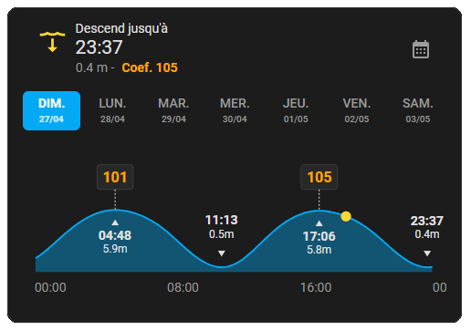

# Intégration Home-Assistant Marées France

Intégration Home-Assistant et sa carte Lovelace pour afficher les marées Françaises du Shom.



## Installation

#### Automatique

[](https://my.home-assistant.io/redirect/hacs_repository/?owner=KipK&category=integration&repository=marees_france)

#### Manuelle

Ajouter le repository à HACS:  <https://github.com/KipK/marees_france>

Rechercher "Marées France" dans HACS et installer.

## Configuration

Dans Appareils et Services / Intégrations, ajouter une Intégration, sélectionner Marées France.
Sélectionner le port le plus proche dans la liste.


Une fois le port sélectionné, l'entité apparaitra dans sensor.marees_france_[NOM_DU_PORT]

## Utilisation

Une carte Lovelace est pré-installée avec l'intégration pour afficher les données sur votre dashboard. Ajouter sur le dashboard la carte marees_france.


Pour récupérer une valeur de l'objet "data" en attribut de l'entité sensor.marees_france_[NOM_DU_PORT], voici un exemple:

Afficher le coefficient de la première marée haute de demain:

```yaml
{{ state_attr('sensor.marees_france_pornichet', 'data')[1]['high_tides'][0]['coefficient'] }}
```
