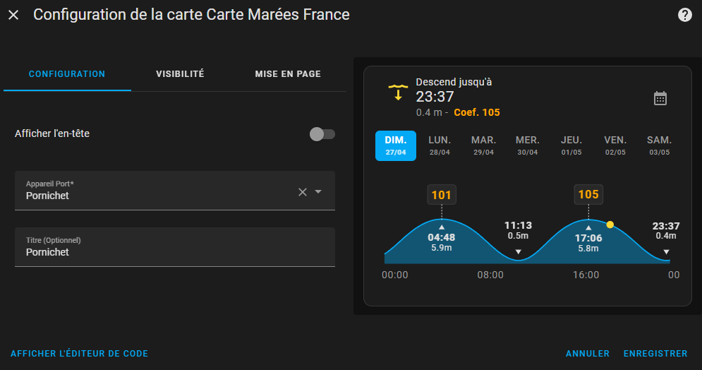

# 🌊 Home Assistant Integration — Tides France

👉 [🇫🇷 Read this documentation in French](./README-fr.md)

**Display French tides from SHOM directly in Home Assistant, with a simple integration and a custom Lovelace card.**


**Author**: [@KipK](https://github.com/KipK)

---

## 🚀 Installation

### Automatic via HACS

[](https://my.home-assistant.io/redirect/hacs_repository/?owner=KipK&category=integration&repository=marees_france)

### Manual

1. Add the repository `KipK/marees_france` to HACS.
2. Search for **Tides France** in HACS and install the integration.

---

## ⚙️ Configuration

1. Go to **Devices & Services → Add Integration**, search for **Tides France**.
2. Select the **nearest port** from the list.


Once configured, the entity will appear as:  
`sensor.marees_france_[PORT_NAME]`

---

## 🖼️ Usage

A **custom Lovelace card** is provided with the integration!  
Simply add the **Tides France card** to your dashboard.



---

## 📈 Entities created

### Current Tide

| Attribute            | Description                    |
|-----------------------|---------------------------------|
| `coefficient`          | Tide coefficient               |
| `tide_trend`           | raising / falling              |
| `current_height`       | Current height                 |
| `starting_height`      | Height at the beginning of the cycle |
| `finished_height`      | Height at the end of the cycle  |
| `starting_time`        | Cycle start time               |
| `finished_time`        | Cycle end time                 |

State: `Rising` or `Falling` until the specified time.

### Next Tide

Same attributes as above, for the next tide event.

### Previous Tide

Same attributes as above, for the last tide event.

### Next Spring Tide

- **State**: Date/Time of the next spring tide (coefficient ≥ 100)
- **Attribute**: `coefficient`

### Next Neap Tide

- **State**: Date/Time of the next neap tide (coefficient ≤ 40)
- **Attribute**: `coefficient`

---

## 🛠️ Available Services

Three services are available:

### 1. Fetch tide data

```yaml
action: marees_france.get_tides_data
data:
  device_id: xxxxxxxxxx
```

### 2. Fetch water levels for a specific date

```yaml
action: marees_france.get_water_levels
data:
  device_id: xxxxxxxxxx
  date: "2025-04-26"
```

### 3. Fetch tide coefficients for multiple days

```yaml
action: marees_france.get_coefficients_data
data:
  device_id: xxxxxxxxxx
  date: "2025-04-26"
  days: 10
```

---

## 🛠️ Frontend Build

To compile the Lovelace card:

```bash
cd frontend
npm install
npm run build
```

The build will be output to:  
`custom_components/marees_info/frontend`

---

# 🎯 Notes

- Data source: **SHOM** (Service Hydrographique et Océanographique de la Marine).
- Fully compatible with **Home Assistant** via **HACS**.

---

👉 [🇫🇷 Read this documentation in French](./README-fr.md)