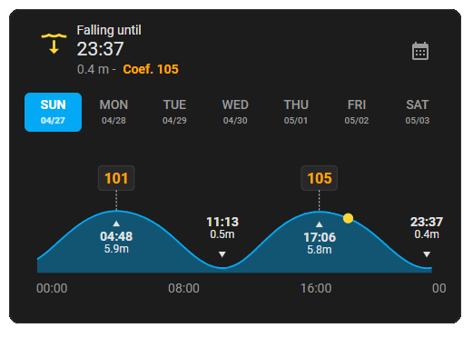
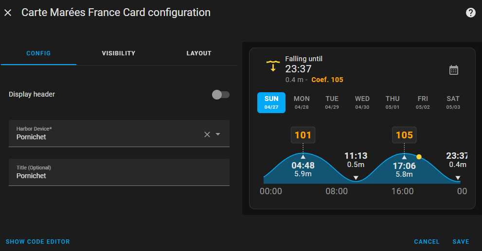

# 🌊 Home Assistant Integration — Marées France

👉 [🇫🇷 Read this documentation in French](./README-fr.md)

**Display French tides from SHOM directly in Home Assistant, with a simple integration and a custom Lovelace card.**



**Author**: [@KipK](https://github.com/KipK)

---

## 🚀 Installation

Search for and install the "Marees France" integration in HACS.

Once the integration is installed and configured, refresh your browser so that Home Assistant displays the card in the card selector.

### Manual

1. Add the repository `KipK/marees_france` to HACS.
2. Search for **Tides France** in HACS and install the integration.

---

## ⚙️ Configuration

1. Go to **Devices & Services → Add Integration**, search for **Tides France**.
2. Select the **nearest port** from the list.
3. *(Optional)* Define the **minimum depth needed to navigate** — this value will be used to adapt graphs to display if your boat can safely navigate at the current water level. Leave at 0 if not needed.


Once configured, the entities will appear as:
- `sensor.marees_france_[PORT_NAME]` — Tide sensor data
- `number.[PORT_NAME]_minimum_depth` — Adjustable minimum depth

---

## 🖼️ Usage

A **custom Lovelace card** is provided with the integration!
Simply add the **Tides France card** to your dashboard.



---

## 📈 Entities created

### Current Tide

| Attribute            | Description                    |
|-----------------------|---------------------------------|
| `coefficient`          | Tide coefficient               |
| `tide_trend`           | raising / falling              |
| `current_height`       | Current height                 |
| `starting_height`      | Height at the beginning of the cycle |
| `finished_height`      | Height at the end of the cycle  |
| `starting_time`        | Cycle start time               |
| `finished_time`        | Cycle end time                 |

State: `Rising` or `Falling` until the specified time.

### Next Tide

Same attributes as above, for the next tide event.

### Previous Tide

Same attributes as above, for the last tide event.

### Next Spring Tide

- **State**: Date/Time of the next spring tide (coefficient ≥ 100)
- **Attribute**: `coefficient`

### Next Neap Tide

- **State**: Date/Time of the next neap tide (coefficient ≤ 40)
- **Attribute**: `coefficient`

### Water Temperature

- **State**: The current water temperature in degrees Celsius.
- **Attributes**: `current_height`, `tide_trend`

### Minimum Depth To Boat

- **Type**: Number entity
- **Description**: Configurable minimum water depth required for your boat to safely navigate
- **Default**: 0 meters
- **Features**:
  - Setting this value will adapt graphics layouts by adding colored 'zones' that indicate the time slot to safely leave/enter the port.
  - Activating this feature will display current depth on current day graph.
  - Adjustable from 0 meters with 0.1 meter increments
  - Value persists across Home Assistant restarts
  - Real-time update of coordinator data when changed
  - Optional : when set to defaut value, no influence on graphs.

---

## 🛠️ Available Services

Six services are available:

### 1. Fetch tide data

```yaml
action: marees_france.get_tides_data
data:
  device_id: xxxxxxxxxx
```

### 2. Fetch water levels for a specific date

```yaml
action: marees_france.get_water_levels
data:
  device_id: xxxxxxxxxx
  date: "2025-04-26"
```

### 3. Fetch tide coefficients for multiple days

```yaml
action: marees_france.get_coefficients_data
data:
  device_id: xxxxxxxxxx
  date: "2025-04-26"
  days: 10
```

### 4. Reset harbor data

```yaml
action: marees_france.reinitialize_harbor_data
data:
  device_id: xxxxxxxxxx
```

### 5. Fetch water temperature for a specific date

```yaml
action: marees_france.get_water_temp
data:
  device_id: xxxxxxxxxx
  date: "2025-04-26"
```

### 6. Get harbor minimum depth

```yaml
action: marees_france.get_harbor_min_depth
data:
  device_id: xxxxxxxxxx
```

---

## Troubleshooting

After updating the integration, refresh your browser to load the new custom card.
If you've not installed it with HACS, you will perhaps have to clear your browser cache first.

## Fetch policy

Integration coordinator fetch data from Shom.fr and stores them in cache.
It then sabity check the cache everyday at a random time, if there's missing or corrupted data it will get missing ones autonomously.

---

## Uninstall

Delete all harbors from Settings/Devices/Marées France
Then remove the integration from HACS or delete the custom_components/marees_france folder

---

## 🛠️ Development

### Setup

Use ***setup.sh*** or ***setup.ps1*** to install required dependencies

### Frontend Build

To compile the Lovelace card:

```bash
cd frontend
npm run build
```

The build will be output to:
`custom_components/marees_info/frontend`

---

### Documentation build

To generate documentation:

```bash
npm run docs
```

### Unit Tests

```bash
pip install -r requirements-test.txt
npm run test
```

---

## 🎯 Notes

- Data source: **SHOM** (Service Hydrographique et Océanographique de la Marine).
- Fully compatible with **Home Assistant** via **HACS**.

---

👉 [🇫🇷 Read this documentation in French](./README-fr.md)
