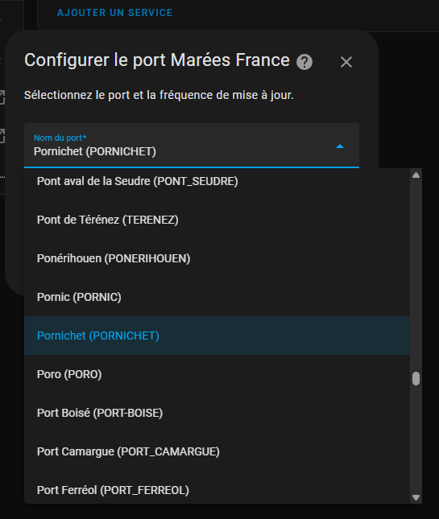

# Marées France Home-Assistant Integration

Home-Assistant integration and its lovelace card to display french tides from Shom.

## Configuration

Add the repository to HACS and install it.

In Devices & Services / Integrations, add and integration, select Marées France.
Harbor list is fetched from Shom automatically.




Once you've selected the harbor, the entity will pop in sensor.marees_france_[HARBOR_NAME]


## Usage

A Lovelace custom card is pre-installed with the integration


In the card configuration add the missing entity:

```yaml
type: custom:marees-france-card
entity: sensor.marees_france_pornichet
```

To get a "data" attribute value using template, here is an example:

Display the coeff for first tomorrow tide:

```yaml
{{ state_attr('sensor.marees_france_pornichet', 'data')[0]['high_tides'][0]['coefficient'] }}
```
